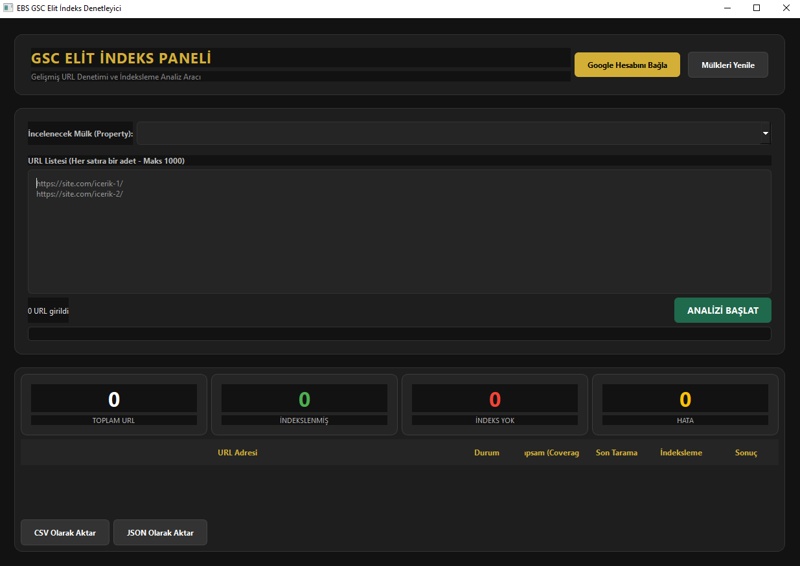

# 🏆 GSC Elit İndeks Denetleyici (Bulk URL Inspector)


**GSC Elit İndeks Denetleyici**, web sitenizdeki yüzlerce URL'nin Google dizinindeki (index) durumunu tek tıkla sorgulamanızı sağlayan, modern "Elite Dark" temalı bir masaüstü uygulamasıdır.

---

## 📸 Uygulama Ekran Görüntüsü



---

## 🚀 Neden Bu Aracı Kullanmalısınız?

Google Search Console paneli üzerinden URL denetimi yapmak oldukça yavaştır; her URL için saniyelerce beklemeniz ve tek tek işlem yapmanız gerekir. 

**Bu araç ile:**
* **Hız Kazanırsınız:** 1000 adete kadar URL'yi listeye ekleyip arkanıza yaslanın.
* **Veri Analizi Yaparsınız:** Sadece "İndekslendi" bilgisini değil, son tarama tarihini, kapsam (coverage) durumunu ve Google'ın seçtiği Canonical URL'yi görürsünüz.
* **Raporlama Yaparsınız:** Sonuçları anında CSV veya JSON olarak dışa aktarıp sunumlarınıza ekleyebilirsiniz.

---

## ✨ Özellikler

* 🌑 **Elit Dark Tema:** Göz yormayan profesyonel Antrasit ve Altın Sarısı arayüz.
* 📊 **Anlık İstatistikler:** Toplam, İndekslenen, Hatalı ve İndeks Almayan URL sayılarını canlı takip edin.
* 🤖 **Google API Entegrasyonu:** Resmi Google Search Console URL Inspection API kullanır.
* 📂 **Dışa Aktarma:** Tek tıkla CSV ve JSON formatında raporlama.
* 🇹🇷 **Tamamen Türkçe:** SEO terimlerine uygun, kullanıcı dostu Türkçe arayüz.

---

## 👥 Kimler İçin Uygun?

* **SEO Uzmanları:** Teknik SEO denetimleri ve içerik performans takibi için.
* **Web Sitesi Sahipleri:** Yeni içeriklerinin Google tarafından fark edilip edilmediğini kontrol etmek için.
* **İçerik Ajansları:** Yayınladıkları içeriklerin indeks durumunu toplu raporlamak için.

---

## 🛠 Kurulum ve Kullanım

### 1. Gereksinimler
Sisteminizde Python 3.9 veya üzeri bir sürümün yüklü olması gerekir.

### 2. Kütüphanelerin Yüklenmesi
Terminal veya komut satırına aşağıdaki komutu yazarak gerekli kütüphaneleri kurun:
```bash
pip install PySide6 google-auth google-auth-oauthlib google-api-python-client
```
